# :pineapple: Pineapple-Monitoring

Projet d’administration système 2018 - CERI

## Informations auteurs :

Auteurs :
* Labrak Yanis
* Vougeot Valentin

Etablissement :

Université d'Avignon - CERI

Licence 2 Informatique - Groupe 4

## Notation enseignant :

- [ ] Collecte d'information
    - [x] Créer la sonde
    - [ ] Mettre en place 3 sondes sur des VM avec CRON
- [ ] Stockage & Collecte Web
    - [x] Stockage de données avec gestion d'historique
        - [x] Utilisation de standard (Json)
        - [x] Moteur de base de données (Sqlite)
    - [ ] Un parseur web
    - [x] Mettre une nouvelle machine sur le réseau nécéssite aucune modification manuelle
- [ ] Affichage & Alerte
    - [x] Detection de crise
    - [x] Envoie de mail
    - [x] Module d'affichage
        - [ ] Terminale
        - [ ] Graphique rrdTools
        - [ ] En ligne
    - [x] Critaires de situation de crise configurable
    - [x] Contenue de l'email configurable
    - [x] Envoie d'email par serveur SMTP Gmail    
- [ ] Communication
    - [x] Module de réception (API avec flask)
    - [x] Module récupération et sauvegarde des informations
    - [ ] Affiche l'historique sous forme de graphique
    - [x] Affichage web

## Topologie :

