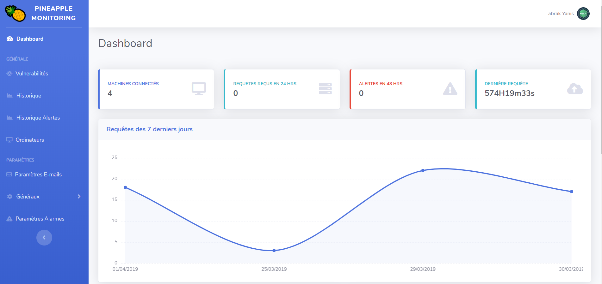

# :pineapple: Pineapple-Monitoring

[](https://www.python.org/)

Pineapple Monitoring provide monitoring of each machines of an entire network.

This project use a client side collector on each machines to collect data about temperature, ram usage, cpu usage, etc .. and send them to the master server throw the HTTP protocol.

On the server side, you can display all the data collected since the past 14 days on a web GUI thanks to the Flask server, Jinja2 and some JavaScript libraries.

:warning: The project is currently under devellopement and isn't currently able to be used on real networks.

## Contributors infos :

#### Contributeurs :
* Labrak Yanis
* Vougeot Valentin

#### Students at :

Université d'Avignon - CERI

Licence 2 Informatique

#### Technologies used :

* Python 2.7
    * Flask
    * Jinja2
    * LXML
* SQLlite 3
* Bash
* Web languages
    * HTML
    * CSS
    * JavaScript
    * JQuery
* JSON

## How to install :

### Download :

```bash
git clone https://github.com/qanastek/Pineapple-Monitoring.git
```

### Install dependencies :

#### Server side :
```bash
cd serveur/
pip install requirements.txt
```

#### Client side :
```bash
cd client/
pip install requirements.txt
```

#### Run the server :
```bash
cd serveur/
python server.py
```

#### Install the client :
```bash
cd client/
sh AutoInstall.sh
```

## Pictures



## Topologie :


