# :pineapple: Pineapple-Monitoring

## Contributors infos :

#### Contributeurs :
* Labrak Yanis
* Vougeot Valentin

#### Students at :

Université d'Avignon - CERI

Licence 2 Informatique

#### Technologie used :

* Python 2.7
    * Flask
    * Jinja2
* SQLlite 3
* Bash
* Web languages
    * HTML
    * CSS
    * JavaScript
    * JQuery
* JSON

## How to install :

### Download :

```bash
git clone https://github.com/qanastek/Pineapple-Monitoring.git
```

### Install dependencies :

#### Server side :
```bash
cd serveur/
pip install requirements.txt
```

#### Client side :
```bash
cd client/
pip install requirements.txt
```

#### Run the server :
```bash
cd serveur/
python server.py
```

#### Install the client :
```bash
cd client/
sh AutoInstall.sh
```

## Topologie :


